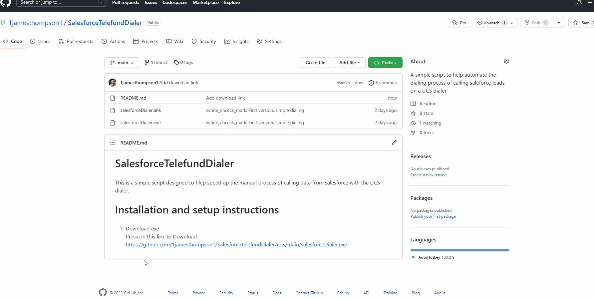
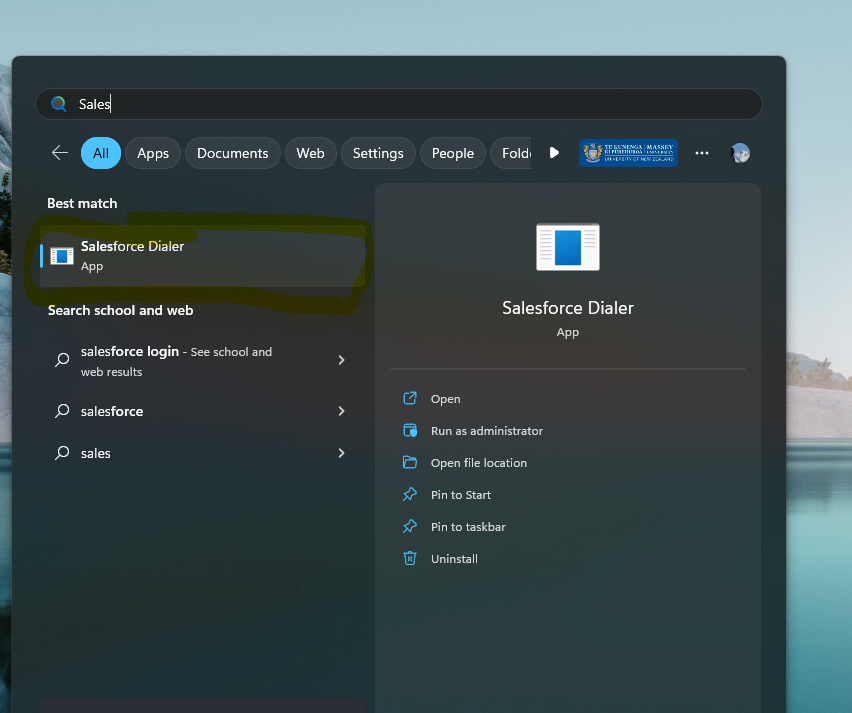

# SalesforceTelefundDialer

This is a simple script designed to hlep speed up the manual process of calling data from salesforce with the UCS dialer.

# Installation and setup instructions

These instructions are incomplete.

1. Download exe  
  Press on this link to Download: https://github.com/1jamesthompson1/SalesforceTelefundDialer/raw/main/salesforceDialer.exe  
  

2. Find exe in your download folder and double click  
  This will start the setup.
  
3. Follow instructions  
  The only thing you need to do is press on the phone number location on your screen. 
  This is the same procedure as was done with the HF and the NZAVS systems.
  
4. Open the program  
  This can be done by searhcing up Sales force dialer in the start menu.  
  Click on the Sales Force Dialer App  
  

# Using
You can navigate the leds like a spreadsheet in sales force.

Navigatite using the arrows to the farthest right column.  

Press right control and it will open up the lead and dial the number found.
